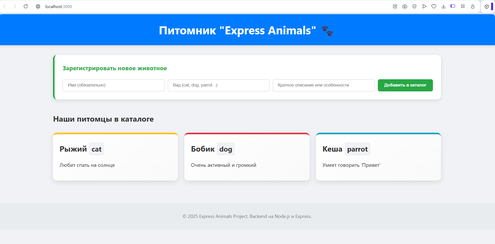
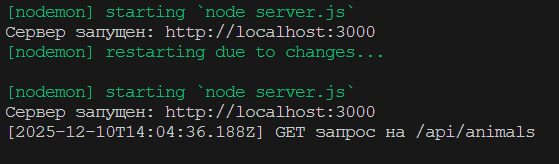

🐾 Проект "Карточки животных" (Express.js API)
Этот проект представляет собой полноценное backend-приложение, реализованное на Express.js, которое предоставляет API для управления каталогом животных (CRUD).

Работа демонстрирует понимание принципов работы Express.js, умение создавать маршруты, работать с middleware, обрабатывать запросы и организовывать структуру backend-приложения.

✨ Основной функционал
Проект реализует следующие возможности:

Просмотр каталога (Read): Получение списка всех карточек животных.

Добавление карточки (Create): Создание нового животного через POST запрос (или форму).

Удаление карточки (Delete): Удаление животного по его уникальному ID через DELETE запрос.

Фильтрация: Возможность фильтровать список по виду животного (/api/animals?species=cat).

Раздача статики: Обслуживание простого HTML/CSS/JS фронтенда.

🛠️ Технологии
Backend: Node.js, Express.js

Имитация БД: Локальный массив в контроллере.

Дополнительно: nodemon (для разработки), собственный Middleware (logger).

🚀 Установка и запуск
Для запуска проекта необходимо установить Node.js.

1. Клонирование репозитория
Bash

git clone <URL вашего репозитория>
cd animal-cards-project
2. Установка зависимостей
Bash

npm install
3. Запуск сервера
Для разработки (с автоматическим перезапуском при изменении кода):

Bash

npm run dev
Для продакшена:

Bash

npm start
Сервер будет запущен на порту 3000. Откройте в браузере: http://localhost:3000

🗺️ Структура проекта
Plaintext

animal-cards-project/
├── controllers/
│   └── animals.controller.js  # Логика CRUD операций
├── routes/
│   └── animals.routes.js      # Маршруты API
├── public/                    # Статические файлы (Фронтенд)
│   ├── index.html
│   ├── styles.css
│   └── script.js
├── middlewares/
│   └── logger.js              # Собственный middleware для логирования
├── server.js                  # Главный файл запуска сервера
└── package.json
Ключевые аспекты Express.js
Файл / Метод	Описание
server.js	Подключение express.json() и express.urlencoded() для обработки тела запроса.
server.js	Использование express.static() для раздачи статического контента.
middlewares/logger.js	Реализация собственного Middleware, который логирует каждый запрос.
controllers/	Обработка req.params (для GET/DELETE по ID) и req.query (для фильтрации).

Export to Sheets

🖥️ API Endpoints (Примеры запросов)
Все маршруты начинаются с /api/animals.

Метод	Маршрут	Описание
GET	/api/animals	Получить весь список животных.
GET	/api/animals?species=cat	Получить список, отфильтрованный по виду (cat, dog и т.д.).
GET	/api/animals/:id	Получить животное по конкретному ID.
POST	/api/animals	Создать новое животное.
DELETE	/api/animals/:id	Удалить животное по ID.

Export to Sheets

Пример POST-запроса (JSON Body)
JSON

{
  "name": "Зоя",
  "species": "turtle",
  "description": "Медленная, но очень милая"
}
📸 Скриншоты

